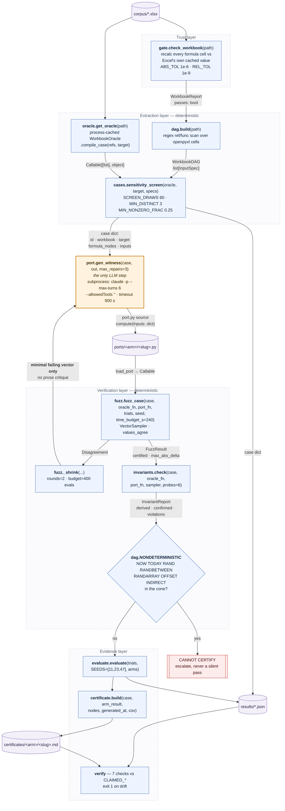
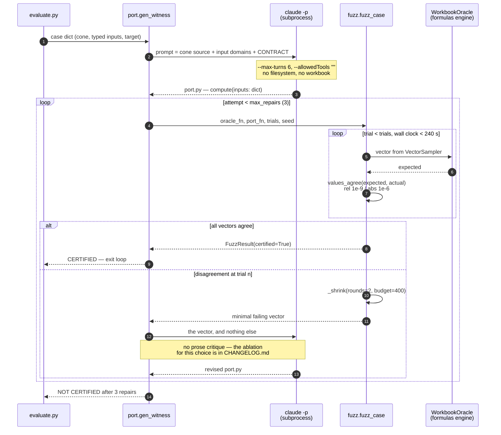

# Witness

## Prove the code still gets the same answer as the spreadsheet — before anyone signs off on it

Finance runs on spreadsheets. Sooner or later engineering rewrites them as code.
The rewrite is routine. **Proving the two agree is not** — and today nobody
really does. The industry check is _"the last three quarters still tie out, ship
it,"_ which is how a wrong number reaches a closed quarter and comes back as a
restatement six months later.

**Witness replaces that check with evidence.** Point it at a workbook and the
cell you care about. It writes the Python, then tries 9,000 generated scenarios
against it. If nothing breaks, you get a **one-page certificate you can put your
name on**: what was tested, over what range, and what it does not cover. If
something breaks, you get the exact input that broke it — and no certificate.

| What sign-off depends on | Before | With Witness |
| ------------------------ | ------ | ------------ |
| What proves the port is right | 3 historical quarters tie out | **9,000 generated scenarios per cell** |
| Who decides it is safe to cut over | whoever is confident | a named reviewer, on a signed certificate |
| What happens when it is wrong | found at the next close | found before sign-off, with the breaking input |
| Cost per cell checked | 2–4 h of manual tie-out | **236 s of compute · $0 in model calls** |

The acceptance oracle is the spreadsheet itself. Never a model — nothing here
asks an AI whether the AI got it right.

> _9,000 = 3,000 trials × 3 independent seeds (11, 23, 47), the budget the
> reported experiment actually ran. The harness and the pytest gate default to
> 10,000 per seed; the reported run was capped to fit the event's clock, and
> every number below comes from the 3,000 × 3 configuration._

---

## Where each deliverable lives

| # | Deliverable | Here |
| - | ----------- | ---- |
| 1 | Solution code + Improvement Changelog | [`src/witness/`](src/witness/) · [CHANGELOG.md](CHANGELOG.md) |
| 2 | Reproduction guide | [REPRODUCE.md](REPRODUCE.md) |
| 3 | Solution video | linked in the submission form |
| 4 | Agent trajectories | [`trajectories/`](trajectories/) |
| — | Prior work · AI tool disclosure · licence | [PRIOR-WORK.md](PRIOR-WORK.md) · [AGENTS.md](AGENTS.md) · [LICENSE](LICENSE) |

**One command checks that every number below is still true:**

```bash
uv run python -m witness.verify
```

It re-derives each published figure from the raw artifacts in `results/` and
exits non-zero if one has drifted.

---

## The team

**Tanya Kaushal** — solo entrant. One person, all four deliverables.

I entered as an individual under the August 2026 edition's one-person rule.
Every line of `src/` and every evaluation case was written after kickoff;
everything I did not write is declared in [PRIOR-WORK.md](PRIOR-WORK.md), and
the coding agents I used — with the trajectories they produced — are disclosed
in [AGENTS.md](AGENTS.md).

---

## Who has this problem

**Owen Castellanos, FP&A controller at a 180-person B2B SaaS company.**

His quarterly revenue-recognition and sales-commission workbook — 11 tabs,
roughly 2,300 formulas — is being moved into the data warehouse by one
contractor. Owen has to personally sign that the Python matches the spreadsheet
before the first quarter closes on it. He is not a programmer. He is the person
whose name is on the number.

### The bottleneck

**Nobody can prove a port is right.** The universal practice is _"tie out three
historical quarters and hope."_

That is structurally broken, and the reason is subtle: historical inputs are a
measure-zero slice of the input space, and they are precisely the slice the bug
already avoided. Divergences hide where historical data never went.

| Failure family           | What Excel does                           | What naive Python does              |
| ------------------------ | ----------------------------------------- | ----------------------------------- |
| Blank vs. zero           | `""` propagates through `SUM` as skip     | `None` raises or coerces to `0`     |
| Rounding                 | `ROUND` is half-away-from-zero            | Python `round` is banker's rounding |
| Text in a numeric column | Coerced to `0` inside `SUM`               | `TypeError`, or silently dropped    |
| Tier boundaries          | `VLOOKUP(..., TRUE)` on an unsorted table | Exact match, or a different tier    |
| Date arithmetic          | `EDATE` returns a serial Excel formats    | a string, a `datetime`, or nothing  |
| Negative inputs          | Often a different branch                  | Untested path                       |

These surface six months later as a restated quarter. The cost is not developer
time. It is a financial restatement.

---

## Architecture

**Design thesis: do not verify the translator — verify each individual
translation, over its whole input domain.** That is _translation validation_,
borrowed from compiler verification (Pnueli, 1998). The field is full of agents
that write code. Almost nobody builds the thing that decides whether written
code may be trusted.

**One model call sits inside eight deterministic stages.** The agent is used
where judgement is needed — reading formulas, writing code — and is excluded
from every step that decides whether that code is correct.

### Component and data flow

Nodes are real modules; edge labels are the actual types passed between them.



### Control flow for one case

Every loop is bounded. The bounds are constants in the source, not conventions.



### Interface contracts

| Module | Entry point | In | Out | Writes |
| ------ | ----------- | -- | --- | ------ |
| `gate` | `check_workbook(path)` | `Path` | `WorkbookReport(passes, compared, agreed, disagreements)` | `results/gate.json` |
| `dag` | `build(path)` | `Path` | `WorkbookDAG(cells, inputs: list[InputSpec], outputs)` | `results/dag.json` |
| `oracle` | `get_oracle(path).compile_case(refs, target)` | `list[str], str` | `Callable[[list], object]` | — |
| `cases` | `sensitivity_screen(oracle, target, specs)` | oracle, `str`, `list` | `tuple[bool, str]` | `results/cases.json` |
| `port` | `gen_witness(case, out, max_repairs=3)` | `dict, Path` | `dict(code, repairs, history, certified)` | `ports/witness/*.py` |
| `fuzz` | `fuzz_case(case, oracle_fn, port_fn, ...)` | callables | `FuzzResult(certified, first_failing_trial, max_abs_delta)` | — |
| `invariants` | `check(case, oracle_fn, port_fn, sampler)` | callables | `InvariantReport(derived, confirmed, violations)` | — |
| `evaluate` | `evaluate(trials, seeds, arms)` | `int, list[int]` | `dict(summary, cases)` | `results/evaluation.json` |
| `certificate` | `build(case, arm_result, nodes, ...)` | `dict` | Markdown `str` | `certificates/<arm>/*.md` |
| `coverage` | `measure(case, probes=60, seed=3)` | `dict` | `dict(cell_coverage, branch_coverage)` | `results/coverage.json` |
| `mutation` | `run(trials=2000, seed=5, arm)` | `int, str` | `dict(summary, cases)` | `results/mutation.json` |
| `pytest_plugin` | `certify_equivalent(workbook, target, port)` | paths | raises `CertificationError` | — |
| `verify` | 7 checks vs `CLAIMED_*` | `results/*` + every `.md` | exit code | — |

### Bounds and constants, and why each exists

| Constant | Value | Location | Why |
| -------- | ----- | -------- | --- |
| `REL_TOL` / `ABS_TOL` | `1e-9` / `1e-6` | `fuzz.py`, `gate.py` | Float equality is not a decision procedure; the tolerance is declared on every certificate |
| `SEEDS` | `[11, 23, 47]` | `evaluate.py` | A single seed can be lucky. `pass^3000` must hold on all three |
| `max_repairs` | `3` | `port.gen_witness` | Bounds agent spend per case; a port needing four repairs is not close |
| `time_budget_s` | `240.0` | `fuzz.fuzz_case` | Records trials actually run rather than silently truncating |
| `_shrink` `budget` | `400` evals | `fuzz.py` | Shrinking is a search; unbounded, one pathological case stalls the run |
| `SCREEN_DRAWS` / `MIN_DISTINCT` / `MIN_NONZERO_FRAC` | `60` / `3` / `0.25` | `cases.py` | Rejects targets constant under sampling — the defect that once let a do-nothing port certify |
| `NONDETERMINISTIC` | 7 Excel functions | `dag.py` | A volatile function cannot have a stable oracle, so the case is refused, not scored |
| `probes` | `6` | `invariants.check` | Each invariant is confirmed on the oracle before being enforced on a port |

Each stage's justification, the evidence that kept it, and the experiments that
were removed are in [CHANGELOG.md](CHANGELOG.md).

---

## How it is measured

**Primary metric: certified-equivalence rate at 9,000 fuzzed vectors per case —
`pass^3000` across 3 independent seeds, not `pass@15`.**

A port is CERTIFIED only if, across all three seeds, every one of 3,000
generated input vectors matches the workbook within relative `1e-9` / absolute
`1e-6`, and no confirmed structural invariant is violated. All-or-nothing on
purpose: Owen gets no partial credit for a port that is right 99% of the time.
One wrong quarter is a restatement.

Ground truth is free and unbounded because **the workbook is the oracle**. Every
generated vector is a labelled case — no rubric, no LLM judge, no
inter-annotator agreement, and **no step where I decided what the right answer
was**.

**The baseline** is a general-purpose agent with file and Python tools, given the
workbook and one instruction: _"port this and make sure it is correct."_ It
self-checks however it likes — typically by tying out historical rows. That is
not a strawman; it is the practice this project exists to challenge.

**Fairness, disclosed.** Both arms get the same cases, fuzzer, tolerance, seeds,
scorer and model. The baseline is *more* privileged in tools
(Read/Write/Edit/Bash) and turns (30 vs 6); Witness is more privileged in context
quality (the extracted cone, a typed domain) and gets a repair loop. That
asymmetry **is** the comparison: better scaffolding versus more freedom.

---

## Result

`uv run python -m witness.evaluate 3000` · raw: [`results/evaluation.json`](results/evaluation.json)

| METRIC | SIMPLE BASELINE | WITNESS | CHANGE |
| ------ | --------------- | ------- | ------ |
| **Certified-equivalence rate** (`pass^3000`, 3 seeds, 37 cases) | **65%** | **86%** | **+22 pp** |
| Ports certified | 24 / 37 | 32 / 37 | +8 |
| Ports that failed | 13 | 5 | −8 |
| Failures wrong by **over a century on a date cell** | **6 of 13** | **0 of 5** | **−6** |
| Worst **date** error | **50,951 days (~139 y)** | 9,132 days (~25 y) | — |
| Worst **currency** error | **$2,340** | **none** | — |
| Machine time to certify one port | — | **236 s** (3 seeds × 3,000 vectors) | — |
| Cost per certification | — | **$0** — the fuzzer calls no model | — |

Paired: **9 Witness wins, 1 loss, 23 both-certified, 4 both-failed.**
**McNemar exact two-sided p = 0.0215 — significant at α = 0.05.**

### What this number attributes, and what it does not

The +22 pp is the **whole scaffold** against the whole baseline. It is not
evidence that any one component caused the gain, and it is not offered as such.

The Witness arm differs in four ways at once: the extracted formula cone instead
of a raw file, a typed input domain, a repair loop, and a shrunk counterexample
as that loop's only feedback. Model, cases, fuzzer, tolerance, seeds and scorer
are held fixed — so the gain is attributable to **scaffolding rather than to the
model**, and to nothing finer.

The one component I tried to isolate is the fourth, and **the attempt failed**.
The ablation ([`results/ablation.json`](results/ablation.json), 12 cases) fed the
repair loop a counterexample, a prose critique, or both:

| Repair signal       | Certified | Mean repairs when certified |
| ------------------- | --------- | --------------------------- |
| Counterexample only | 12 / 12   | 0.08                        |
| Prose critique only | 11 / 12   | 0.00                        |
| Both                | 12 / 12   | 0.08                        |

**Null, and diagnosably so:** 0.08 repairs per case means the loop fired roughly
once across twelve cases. You cannot compare two repair signals on a corpus that
almost never needs repairing. So the design claim — that a minimal failing input
repairs better than a critic's narrative — is **stated but UNPROVEN**, and is
labelled that way everywhere it appears.

### The finding that matters more than the rate

**Six of the baseline's thirteen failures return a date more than a century away
from the correct one.**

Those six are fiscal-year cells — `=EDATE(Z16,12)` and references to it — where
the port dropped Excel's date semantics entirely. **The unit is days, not
dollars:** 50,951 days is the distance from Excel's epoch to 30 June 2039, the
value the workbook actually holds. Witness's five failures are three ±1
disagreements, one zero-delta structural failure, and one shared hard case.
Across the whole run the baseline has exactly one currency failure, **$2,340**.
Witness has **none**.

> **A correction, recorded rather than quietly fixed.** An earlier version of
> this README reported those six as dollar amounts and headlined a *"median
> error when it failed"* of five figures. That was wrong twice over — the deltas
> are date serials, not money, and the median was taken over the ten nonzero
> failures rather than all thirteen (the median of all thirteen is $2,340). Both
> figures are now banned by name in the claim verifier, so neither can come
> back. The full record is in [CHANGELOG.md](CHANGELOG.md).

#### Every failed port, and how wrong it actually is

Bars are scaled to the largest error in the run. Units differ by cell, so they
are stated per row — this is the whole point: six of the baseline's failures are
dates off by more than a century, not money.

**Baseline — 13 failures**

| Target cell | Unit | Error | |
| ----------- | ---- | ----: | - |
| `Fiscal Years.AA16` | date | 50,951 days | ████████████████████████████████████ |
| `Available Funds.T48` | date | 48,030 days | ██████████████████████████████████ |
| `Available Funds.S48` | date | 47,665 days | ██████████████████████████████████ |
| `Available Funds.N48` | date | 47,665 days | ██████████████████████████████████ |
| `Available Funds.N53` | date | 47,664 days | ██████████████████████████████████ |
| `Available Funds.M48` | date | 47,300 days | █████████████████████████████████ |
| `Levy Limit.E19` | currency | $2,340 | ██ |
| `Debt.I8` | number | 1 | ▏ |
| `Available Funds.M53` | date | 1 day | ▏ |
| `6 - Operating Expenditures.K35` | number | 0.0003 | ▏ |
| `Fiscal Years.AA13` · `Available Funds.T53` · `CPF.Q20` | — | 0 — structural failure, no value delta | |

**Witness — 5 failures**

| Target cell | Unit | Error | |
| ----------- | ---- | ----: | - |
| `Fiscal Years.AA16` | date | 9,132 days | ██████ |
| `Debt.H8` | number | 1 | ▏ |
| `Available Funds.S48` | date | 1 day | ▏ |
| `Available Funds.M53` | date | 1 day | ▏ |
| `CPF.Q20` | — | 0 — structural failure, no value delta | |

Neither arm certified the hardest case, `Fiscal Years.AA16`; both certificates
read **NOT EQUIVALENT**. The difference is that the baseline's port is what a
team ships today, and it is wrong by 139 years.

---

### What Owen actually receives

One file per certified cell, in `certificates/`. Not a green checkmark — a
document with a scope, a signature block, and an explicit list of what it does
**not** cover.

```markdown
# Equivalence certificate — financial-forecasting-template-10-year::Available Funds.T48

## Verdict: CERTIFIED EQUIVALENT

| Target cell             | Available Funds.T48   |
| Formula nodes behind it | 37                    |
| Trials per seed         | 3,000                 |
| Seeds                   | 11, 23, 47            |
| Total input vectors     | 9,000                 |
| Numeric tolerance       | rel 1e-9, abs 1e-6    |

## Coverage — what the trials actually exercised
| Formula cells in this target's cone   | 18        |
| Cells whose value varied under sampling | 18 (100%) |
| Cells constant for this input domain    | 0         |

## What this certificate does NOT cover
- Only the target cell above. Other outputs are unexamined.
- Only the declared input domain.
- Sampling, not proof.
- The oracle is a re-implementation of Excel, not Excel.
- Volatile functions excluded — they cannot have a stable oracle.

## Sign-off
This certificate is a recommendation to a qualified human reviewer. It is
not an authorization to cut over. The reviewer below owns that decision.

Reviewed by: ____________________   Date: __________
Role:        ____________________
Accepted for production cut-over:   [ ] yes   [ ] no
```

A certificate that lists only its successes is marketing. This one states its
own limits first, because the person signing it carries the consequence.

---

## Is the verifier itself trustworthy?

A verifier that only ever says yes has proven nothing. Four independent checks
say it does not:

| Check | Result | Why it exists |
| ----- | ------ | ------------- |
| **Engine-trust gate** | **12/12 usable workbooks · 36,500 cells · 0 disagreements** | If the oracle were silently wrong, every number downstream is worthless |
| **Harness self-test** | identity **300/300** per case; a port that always returns `0.0` is **caught on all 37** | My own eval once certified a do-nothing port on 9 of 16 cases |
| **Mutation suite** | **189/231 semantic mutants killed (81.8%)** · **0/165 false alarms** | Kill rate alone rewards paranoia; the equivalent-mutant controls bound it |
| **Oracle coverage** | **91.4% mean cell coverage · 100% branch coverage** | "9,000 vectors agreed" is weak if every vector drove the same branch |

Five of the 17 workbooks are excluded from the gate because they carry **no
cached formula values at all** — nothing to validate the engine against. That is
a property of those files, and a **disclosed case-selection criterion**, not a
hidden filter.

---

## Reproducing this

Three commands. No Docker, no database, no API key, no network at judge time.
All 17 workbooks are vendored into `corpus/`. Full guide:
[REPRODUCE.md](REPRODUCE.md).

```bash
git clone https://github.com/TKAUSHAL2301/witness.git && cd witness
uv sync
uv run python -m witness.verify
```

```
[GREEN]  engine-trust gate     12/17 workbooks · 36,500 cells · 0 disagreements
[GREEN]  harness self-test     37/37 cases · identity 300/300 · shortcut caught
[GREEN]  rejection tests       3 passed
[GREEN]  experiment            baseline 24/37 → witness 32/37 (+22pp) at pass^3000
[GREEN]  mutation score        189/231 semantic mutants killed (81.8%) · 0/165 false alarms
[GREEN]  oracle coverage       91.4% mean cell coverage · 100% branch coverage
[GREEN]  document claims       8 documents clean · corpus 17 · cases 37 · LICENSE present
ALL 7 CHECKS GREEN — every published figure is backed by results/.
```

The seventh check reads **every prose document in the repository** and turns red
if a superseded claim reappears in any of them. It exists because the same
figures drifted three times during this build while all the other checks stayed
green — the tests and the claims were never being compared to each other.

To watch the argument happen on one cell instead of reading a scoreboard — both
ports loaded from disk and fuzzed live, nothing replayed:

```bash
uv run python -m witness.demo          # ~30 s
```

It ties both ports out against the values the workbook was saved with (they
match — exactly where a migration gets signed off today), then draws 3,000
inputs the history never contained and shrinks the first failure to the smallest
input that still breaks it.

---

## Status and honest limits

| Stage | State |
| ----- | ----- |
| 0 · Engine-trust gate | 12/12 usable workbooks, 36,500 cells, 0 disagreements |
| 1 · Formula-DAG extractor | 14 workbooks parsed ([`results/dag.json`](results/dag.json)) — the other 3 hold **0 formula cells** |
| 2 · Case scoping + sensitivity screen | **37 cases** across 7 workbooks; always-zero shortcut caught on every one |
| 3 · Per-block translation | the one LLM step; cone-scoped, never the raw workbook |
| 4 · Differential fuzzer | 9,000 vectors per certified case (3,000 × 3 seeds) |
| 5 · Shrink + repair loop | only the shrunk counterexample is fed back — **contribution UNPROVEN** |
| 6 · Invariant layer | **106 derived, 53 confirmed** on the oracle (9 scale, 44 monotone), **0 violated by any of the 74 ports** — a reported null |
| 7 · Refusal gate | volatile and unsupported functions rejected, never silently passed |
| 8 · Certificate | signable, with a **quantified** coverage section |
| 9 · Mutation suite | 7 semantic mutants + 5 equivalent false-alarm controls per case |
| 10 · Coverage map | 91.4% mean cell, 100% branch |
| 11 · pytest plugin | `certify_equivalent()` — ships as a CI gate |
| 12 · Claim verifier | `witness.verify` — 7 checks, exits non-zero on drift |

**Main failure mode:** the oracle is a re-implementation of Excel, not Excel. A
function it computes *differently* from Excel would be invisible, because both
sides of the comparison would be wrong the same way. Mitigated structurally:
unsupported functions are refused rather than passed, and every certificate
states what it does not cover.

**Second limit:** the corpus is too **easy**, not too small. 37 cases clears the
brief's ten-case bar comfortably, but eleven have a single free input and the
repair loop fired roughly once across the whole ablation. Harder cases — deep
cones with rounding, tier boundaries and date semantics — are the next
investment, not more cases of the same difficulty.

**Hot take, in one line:** _"it ties out on historical data"_ is the most
dangerous sentence in software migration. If your acceptance test is a fixed
case set, you are testing the cases the bug already avoided — give the verifier
a **generator**, not a checklist. The full argument, and the story of my own
evaluation certifying a port that did nothing at all, is at the end of
[CHANGELOG.md](CHANGELOG.md).

---

Data: 17 municipal finance workbooks published by the Commonwealth of
Massachusetts, Division of Local Services. Public records; provenance and
licences in [PRIOR-WORK.md](PRIOR-WORK.md). Code MIT — [LICENSE](LICENSE).
